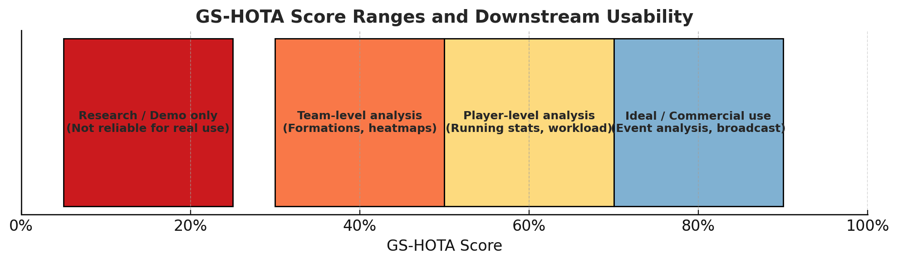

# GS-HOTA 指标应用指南

	•	教练/战术分析（关注整体队形、空间利用）
		•	主要依赖“定位准确性”和“队伍/角色识别”。
		•	球衣号（个体身份）次要。
		•	实际上，只要 GS-HOTA 在 40–50% 左右，就能提供较为可靠的整体态势数据。
	•	运动表现/运动量统计（关注个体轨迹，谁跑了多少米）
		•	必须保证球员 ID（球衣号）稳定，不能频繁 ID switch。
		•	需要 GS-HOTA ≥ 60% 才能比较可信。
	•	精细事件分析（如“7号球员完成了这次助攻”）
	   •	身份和定位都要高度准确。
	   •	理想要求 GS-HOTA ≥ 70–80%，才能避免大规模误报。
	•	商业/粉丝互动（例如自动生成 highlight 视频、虚拟解说）
	   •	容忍度相对高，只要大部分队伍和角色识别对即可。
	   •	30–40% 就可能有用，但画质和体验会受影响。