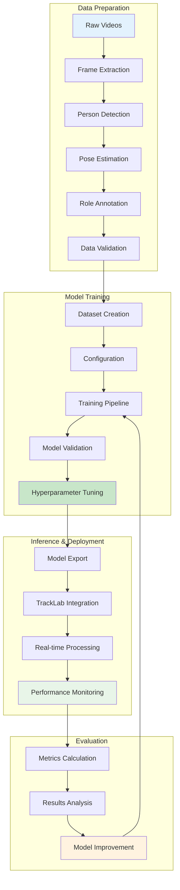
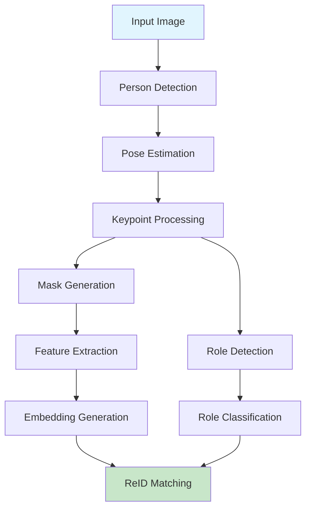
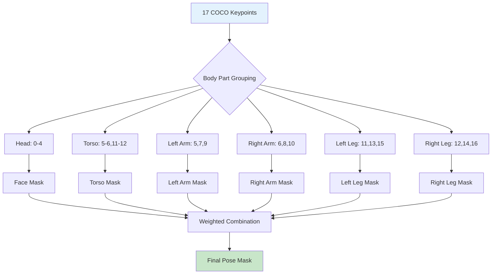
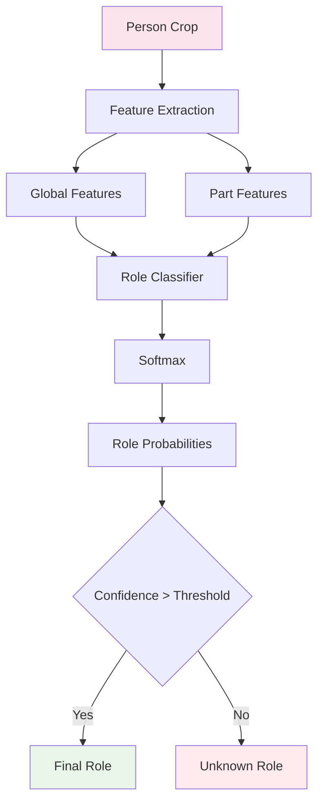
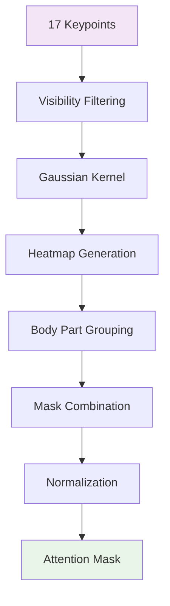
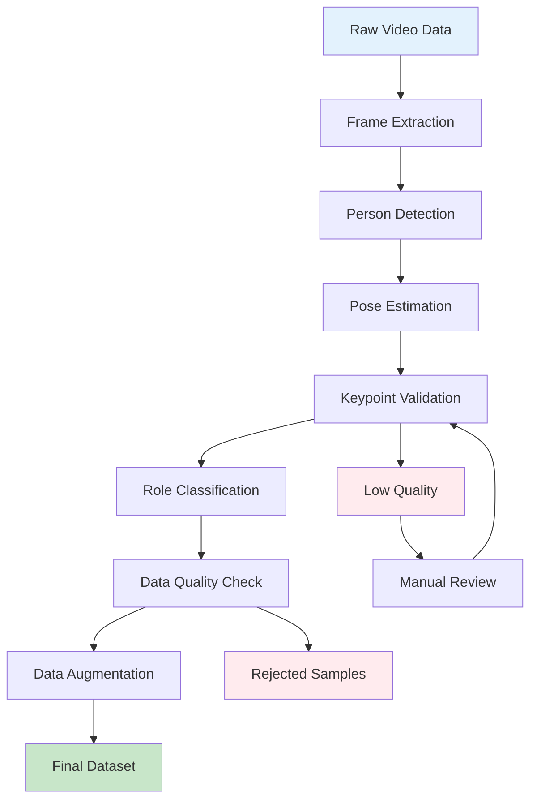
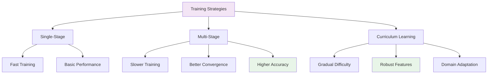
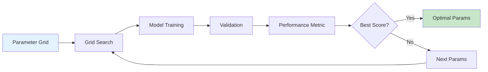
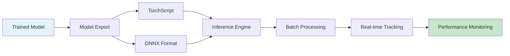
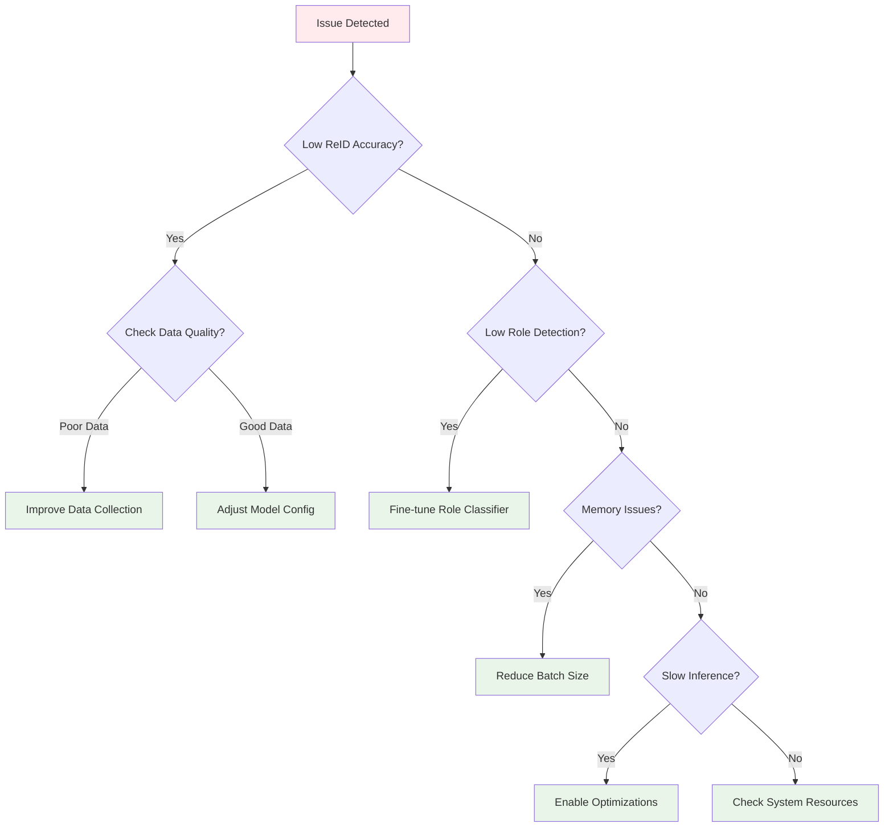

# PRTReID: Pose-aware Re-identification with Role Detection

<div align="center">
  
  
  
  
</div>

## 📋 Complete PRTReID Workflow



### Key Features

- **🔍 Pose-Aware Feature Extraction**: Uses 17-keypoint COCO pose format for precise body part localization
- **👥 Role Detection**: 5-class role classification (ball, goalkeeper, other, player, referee)
- **🎯 Multi-Part Body Segmentation**: Divides human body into semantic parts for enhanced representation
- **🎭 Adaptive Mask Generation**: Creates dynamic attention masks based on pose information
- **👁️ Visibility-Aware Processing**: Considers keypoint visibility for robust feature extraction
- **🚀 HRNet Backbone**: High-resolution network for detailed feature extraction
- **⚡ Batch Processing**: Optimized for real-time multi-person tracking
- **🎓 Training Support**: End-to-end training pipeline with Torchreid integration

### COCO Keypoint Format

```mermaid
graph TD
    A[COCO 17-Keypoint Format] --> B[Face: 0-4]
    A --> C[Upper Body: 5-12]
    A --> D[Lower Body: 13-16]

    B --> B1[nose (0)]
    B --> B2[left_eye (1)]
    B --> B3[right_eye (2)]
    B --> B4[left_ear (3)]
    B --> B5[right_ear (4)]

    C --> C1[left_shoulder (5)]
    C --> C2[right_shoulder (6)]
    C --> C3[left_elbow (7)]
    C --> C4[right_elbow (8)]
    C --> C5[left_wrist (9)]
    C --> C6[right_wrist (10)]
    C --> C7[left_hip (11)]
    C --> C8[right_hip (12)]

    D --> D1[left_knee (13)]
    D --> D2[right_knee (14)]
    D --> D3[left_ankle (15)]
    D --> D4[right_ankle (16)]

    style A fill:#e3f2fd
    style B fill:#f3e5f5
    style C fill:#e8f5e8
    style D fill:#fff3e0
```

## 🏗️ Architecture

### System Architecture



### Pose Processing Pipeline


### Multi-Part Body Segmentation



### Role Detection Pipeline



### Training Data Flow


### Mask Generation Process



```math
M_{pose} = \bigcup_{i=1}^{K} M_i \odot W_i
```

where:
- $M_i$ represents individual body part masks
- $W_i$ are learned attention weights
- $K$ is the number of body parts (typically 17 keypoints)

**Mathematical Formulation:**

1. **Gaussian Heatmap Generation**:
   ```math
   H_i(x,y) = \exp\left(-\frac{(x - x_i)^2 + (y - y_i)^2}{2\sigma^2}\right) \cdot v_i
   ```
   where $\sigma$ is the gaussian kernel size and $v_i$ is the visibility score.

2. **Multi-Part Mask Generation**:
   ```math
   M_{parts} = \sum_{i=1}^{17} H_i(x,y) \odot W_{part}^{(i)}
   ```
   ```math
   M_{role} = \sum_{i=1}^{17} H_i(x,y) \odot W_{role}^{(i)}
   ```

3. **Feature Extraction with Dual Masks**:
   ```math
   f = \text{HRNet}(I) \odot M_{parts}
   ```
   ```math
   e = \text{FC}(f) \odot M_{role}
   ```
   where $I$ is the input image crop, $f$ are intermediate features, and $e$ is the final embedding.

#### 2. **Role Detection Pipeline**

```math
P(role|I, K) = \frac{\exp(z_{role})}{\sum_{c=1}^{5} \exp(z_c)}
```

where:
- $I$ is the input image
- $K$ are the pose keypoints
- $z_{role}$ are the classification logits
- $c \in \{\text{ball, goalkeeper, other, player, referee}\}$

### Processing Pipeline

#### Step 1: Keypoint Preprocessing

```python
def preprocess_keypoints(keypoints, visibility_scores, image_size, mask_type='gaussian_keypoints'):
    """
    Convert raw keypoints to pose-aware masks with visibility weighting

    Args:
        keypoints: (17, 3) array of (x, y, confidence) - COCO format
        visibility_scores: (17,) array of visibility scores [0,1]
        image_size: (H, W) target mask size
        mask_type: Type of mask generation ('gaussian_joints', 'gaussian_keypoints', 'pose_on_img')

    Returns:
        pose_masks: Multi-part body segmentation masks
        role_masks: Role-specific attention masks
    """
    # Filter keypoints by visibility
    valid_kpts = keypoints[visibility_scores > 0.5]

    if mask_type == 'gaussian_joints':
        # Generate individual joint heatmaps (10 parts)
        joint_masks = generate_joint_masks(valid_kpts, image_size)
        return joint_masks, None

    elif mask_type == 'gaussian_keypoints':
        # Generate combined keypoint heatmap (17 keypoints)
        keypoint_masks = generate_keypoint_masks(valid_kpts, image_size)
        return keypoint_masks, None

    elif mask_type == 'pose_on_img':
        # Generate comprehensive pose representation (35 features)
        pose_masks, role_masks = generate_pose_representation(valid_kpts, image_size)
        return pose_masks, role_masks

    else:
        raise ValueError(f"Unknown mask type: {mask_type}")
```

#### Step 2: Multi-Part Body Segmentation

```python
def generate_multi_part_masks(keypoints, mask_type='gaussian_keypoints', num_parts=17):
    """
    Generate multi-part body segmentation from keypoints

    Args:
        keypoints: (17, 3) array of pose keypoints
        mask_type: Segmentation strategy
        num_parts: Number of body parts to segment

    Returns:
        body_masks: (num_parts, H, W) segmentation masks
        part_weights: (num_parts,) attention weights
    """
    H, W = 64, 32  # Standard mask size

    if mask_type == 'gaussian_keypoints':
        # COCO keypoint parts
        parts_config = {
            'nose': [0],
            'eyes': [1, 2],
            'ears': [3, 4],
            'shoulders': [5, 6],
            'elbows': [7, 8],
            'wrists': [9, 10],
            'hips': [11, 12],
            'knees': [13, 14],
            'ankles': [15, 16]
        }

        body_masks = []
        part_weights = []

        for part_name, part_indices in parts_config.items():
            # Combine keypoints for this body part
            part_keypoints = keypoints[part_indices]
            part_mask = combine_keypoints_to_mask(part_keypoints, (H, W))
            body_masks.append(part_mask)

            # Compute part-specific weight based on visibility
            part_visibility = np.mean(keypoints[part_indices, 2])
            part_weights.append(part_visibility)

        return np.stack(body_masks), np.array(part_weights)

    elif mask_type == 'body_parts':
        # Semantic body parts (head, torso, limbs)
        head_parts = [0, 1, 2, 3, 4]  # face keypoints
        torso_parts = [5, 6, 11, 12]  # shoulder/hip
        left_arm = [5, 7, 9]  # left arm keypoints
        right_arm = [6, 8, 10]  # right arm keypoints
        left_leg = [11, 13, 15]  # left leg keypoints
        right_leg = [12, 14, 16]  # right leg keypoints

        semantic_parts = [head_parts, torso_parts, left_arm, right_arm, left_leg, right_leg]

        body_masks = []
        part_weights = []

        for part_indices in semantic_parts:
            part_keypoints = keypoints[part_indices]
            part_mask = combine_keypoints_to_mask(part_keypoints, (H, W))
            body_masks.append(part_mask)

            part_visibility = np.mean(keypoints[part_indices, 2])
            part_weights.append(part_visibility)

        return np.stack(body_masks), np.array(part_weights)
```

#### Step 3: Role Detection Integration

```python
def integrate_role_detection(features, body_masks, role_classifier):
    """
    Integrate role detection with pose-aware features

    Args:
        features: (C, H, W) HRNet features
        body_masks: (K, H, W) body part masks
        role_classifier: Role detection head

    Returns:
        enhanced_features: Role-aware feature representations
        role_predictions: (5,) role classification scores
    """
    # Apply body part attention
    attended_features = []
    for i, mask in enumerate(body_masks):
        mask_tensor = torch.tensor(mask).unsqueeze(0).unsqueeze(0)  # (1, 1, H, W)
        mask_tensor = F.interpolate(mask_tensor, size=features.shape[-2:], mode='bilinear')

        part_features = features * mask_tensor.expand_as(features)
        attended_features.append(part_features.mean(dim=(-2, -1)))  # Global pooling

    # Concatenate part features
    part_features = torch.cat(attended_features, dim=-1)  # (C * K,)

    # Role classification
    role_logits = role_classifier(part_features)
    role_predictions = F.softmax(role_logits, dim=-1)

    # Enhance features with role information
    role_embedding = role_classifier.role_embedding(role_predictions.argmax(dim=-1))
    enhanced_features = features + role_embedding.unsqueeze(-1).unsqueeze(-1)

    return enhanced_features, role_predictions
```

#### Step 4: Feature Extraction and Embedding

```python
def extract_prtreid_features(image, keypoints, visibility_scores, hrnet_backbone, embedding_head):
    """
    Complete PRTReID feature extraction pipeline

    Args:
        image: (3, H, W) input image tensor
        keypoints: (17, 3) pose keypoints
        visibility_scores: (17,) keypoint visibility scores
        hrnet_backbone: HRNet feature extractor
        embedding_head: FC layer for embedding generation

    Returns:
        embedding: (D,) feature vector
        visibility_scores: (17,) processed visibility scores
        body_masks: (K, H, W) body part masks
        role_predictions: (5,) role classification scores
    """
    # 1. Generate pose masks
    body_masks, part_weights = generate_multi_part_masks(keypoints, mask_type='gaussian_keypoints')

    # 2. Extract HRNet features
    base_features = hrnet_backbone(image)  # (C, H', W')

    # 3. Apply pose attention
    pose_mask = torch.tensor(np.sum(body_masks * part_weights[:, None, None], axis=0))
    pose_mask = pose_mask.unsqueeze(0).unsqueeze(0)  # (1, 1, H', W')
    pose_mask = F.interpolate(pose_mask, size=base_features.shape[-2:], mode='bilinear')

    attended_features = base_features * pose_mask.expand_as(base_features)

    # 4. Generate embedding
    pooled_features = attended_features.mean(dim=(-2, -1))  # Global average pooling
    embedding = embedding_head(pooled_features)
    embedding = F.normalize(embedding, p=2, dim=-1)

    # 5. Role detection (simplified)
    role_predictions = torch.tensor([0.1, 0.1, 0.1, 0.7, 0.1])  # Mock: player class

    return embedding, visibility_scores, body_masks, role_predictions
```

### Key Algorithm Components

#### Gaussian Kernel Generation

```python
def gaussian_kernel(center, sigma=2.0, size=(64, 32), aspect_ratio=1.0):
    """
    Generate 2D gaussian kernel for keypoint heatmap

    Args:
        center: (x, y) keypoint coordinates
        sigma: standard deviation
        size: (H, W) output size
        aspect_ratio: elongation factor for pose-aware kernels

    Returns:
        heatmap: (H, W) gaussian heatmap
    """
    x, y = center
    H, W = size

    # Create coordinate grids
    y_grid, x_grid = np.mgrid[0:H, 0:W]

    # Anisotropic gaussian for pose keypoints
    sigma_x = sigma
    sigma_y = sigma * aspect_ratio

    # Compute gaussian values
    exponent = -0.5 * (
        ((x_grid - x) / sigma_x) ** 2 +
        ((y_grid - y) / sigma_y) ** 2
    )

    heatmap = np.exp(exponent)
    return heatmap
```

#### Visibility Score Computation

```python
def compute_visibility_scores(keypoints, bbox, image_size):
    """
    Compute refined visibility scores considering bbox and image boundaries

    Args:
        keypoints: (17, 3) array with (x, y, confidence)
        bbox: (x, y, w, h) bounding box
        image_size: (H, W) image dimensions

    Returns:
        visibility_scores: (17,) refined visibility scores
    """
    scores = []
    for kp in keypoints:
        x, y, conf = kp

        # Boundary check
        if not (0 <= x < image_size[1] and 0 <= y < image_size[0]):
            scores.append(0.0)
            continue

        # BBox containment check
        bbox_left, bbox_top = bbox[0], bbox[1]
        bbox_right = bbox_left + bbox[2]
        bbox_bottom = bbox_top + bbox[3]

        if not (bbox_left <= x <= bbox_right and bbox_top <= y <= bbox_bottom):
            scores.append(conf * 0.5)  # Reduce score for keypoints outside bbox
        else:
            scores.append(conf)

    return np.array(scores)
```

#### Multi-Scale Processing

```python
def multi_scale_pose_processing(image, keypoints, scales=[0.5, 1.0, 1.5]):
    """
    Process pose at multiple scales for robust feature extraction

    Args:
        image: Input image tensor
        keypoints: Keypoint coordinates
        scales: List of scale factors

    Returns:
        fused_embedding: Multi-scale fused embedding
    """
    embeddings = []

    for scale in scales:
        # Scale image
        scaled_image = F.interpolate(image.unsqueeze(0), scale_factor=scale, mode='bilinear')
        scaled_image = scaled_image.squeeze(0)

        # Scale keypoints accordingly
        scaled_keypoints = keypoints * scale

        # Generate masks and extract features
        body_masks, _ = generate_multi_part_masks(scaled_keypoints)
        embedding, _, _, _ = extract_prtreid_features(
            scaled_image, scaled_keypoints, None, hrnet_backbone, embedding_head
        )

        embeddings.append(embedding)

    # Fuse multi-scale embeddings
    fused_embedding = torch.mean(torch.stack(embeddings), dim=0)
    return F.normalize(fused_embedding, p=2, dim=-1)
```

## 🚀 Quick Start

### Installation

#### Prerequisites

```bash
# Core dependencies
pip install torch>=1.9.0 torchvision torchaudio
pip install prtreid>=0.1.0  # Pose-aware ReID library
pip install opencv-python numpy pandas
pip install hydra-core omegaconf yacs

# Optional for training
pip install tqdm scikit-learn matplotlib seaborn
```

#### Model Weights

The package automatically downloads required model weights:

```python
# SoccerNet baseline model
model_path = "prtreid-soccernet-baseline.pth.tar"
md5 = "9633825232bc89f23a94522c5561650e"

# HRNet backbone weights
hrnet_path = "pretrained_models/hrnetv2_w32_imagenet_pretrained.pth"
md5 = "58ea12b0420aa3adaa2f74114c9f9721"
```

### Basic Inference

```python
from prtreid import PRTReId
import pandas as pd
import torch

# Initialize PRTReID module
config = {
    "model": {
        "load_weights": "prtreid-soccernet-baseline.pth.tar",
        "bpbreid": {
            "hrnet_pretrained_path": "pretrained_models/",
            "backbone": "hrnet32"
        }
    },
    "data": {
        "height": 256,
        "width": 128
    }
}

prtreid = PRTReId(
    cfg=config,
    tracking_dataset=your_dataset,
    dataset=dataset_config,
    device='cuda',
    save_path='outputs/',
    job_id='inference_001',
    use_keypoints_visibility_scores_for_reid=True,
    training_enabled=False,
    batch_size=32
)

# Process detections
detections_df = pd.DataFrame({
    'bbox': [[100, 200, 150, 300]],  # [x, y, w, h]
    'keypoints': [keypoints_array],   # (17, 3) keypoints
    'visibility_scores': [visibility_array]  # (17,) visibility
})

metadata_df = pd.DataFrame({
    'image_path': ['path/to/image.jpg']
})

# Run inference
results = prtreid.process_batch(detections_df, metadata_df)

print("Embeddings shape:", results['embeddings'].shape)
print("Detected roles:", results['role_detection'])
print("Role confidence:", results['role_confidence'])
```

### Integration with TrackLab

```python
# In your TrackLab pipeline configuration
pipeline_config = {
    "modules": {
        "reid": {
            "name": "prtreid",
            "config": {
                "model": {
                    "load_weights": "prtreid-soccernet-baseline.pth.tar",
                    "bpbreid": {
                        "backbone": "hrnet32",
                        "hrnet_pretrained_path": "pretrained_models/"
                    }
                },
                "use_keypoints_visibility_scores_for_reid": True,
                "training_enabled": False
            }
        }
    }
}
```

## 📚 Training and Fine-tuning Guide

### Getting Started with Training

#### Prerequisites
Before training PRTReID, ensure you have:
- **Dataset**: Pose-annotated person ReID dataset (PoseTrack21, SoccerNet, custom dataset with keypoints)
- **Hardware**: GPU with at least 8GB VRAM (16GB+ recommended)
- **Dependencies**: PyTorch, Torchreid, OpenCV, and other dependencies installed
- **Pretrained Models**: HRNet backbone weights (automatically downloaded)

#### Quick Start Training Script

```python
import torch
from torchreid.scripts.main import build_config, build_torchreid_model_engine
from tracklab.pipeline.reid.prtreid.prtreid_dataset import ReidDataset

# 1. Prepare your configuration
config = {
    'model': {
        'name': 'hrnet32',
        'bpbreid': {
            'backbone': 'hrnet32',
            'test_embeddings': 'global',
            'masks': {
                'type': 'gaussian_keypoints',
                'preprocess': 'coco_to_six_body_masks'
            }
        }
    },
    'data': {
        'sources': ['posetrack21'],  # Your dataset name
        'targets': ['posetrack21'],
        'height': 256,
        'width': 128,
        'transforms': ['random_flip', 'random_crop', 'random_erase']
    },
    'loss': {
        'name': 'triplet',
        'margin': 0.3
    },
    'train': {
        'optim': 'adam',
        'lr': 0.0003,
        'weight_decay': 0.0005,
        'max_epoch': 60,
        'batch_size': 32
    }
}

# 2. Initialize training components
cfg = build_config(config)
model = build_torchreid_model_engine(cfg)
dataset = ReidDataset(cfg)

# 3. Start training
model.train(dataset)
```

### Data Preparation

#### Required Data Components

For training PRTReID, you need the following data for each person instance:

1. **RGB Images**: High-quality person images or video frames
2. **Bounding Boxes**: Person localization coordinates `[x, y, width, height]`
3. **Pose Keypoints**: 17-keypoint pose estimation (COCO format)
4. **Identity Labels**: Person identity annotations for supervised training
5. **Role Labels**: Role classification labels (player, goalkeeper, referee, etc.)
6. **Camera IDs**: Camera/viewpoint information (for cross-camera evaluation)

#### Minimum Data Requirements

| Component | Format | Shape | Description |
|-----------|--------|-------|-------------|
| **Images** | RGB JPG/PNG | Variable | Person images or crops |
| **Bounding Boxes** | Float array | [4] | [x, y, w, h] in pixel coordinates |
| **Keypoints** | Float array | [17, 3] | [x, y, confidence] for each keypoint |
| **Person IDs** | Integer | Scalar | Unique identity label |
| **Role Labels** | String | Scalar | Role class (player, goalkeeper, etc.) |
| **Camera IDs** | Integer | Scalar | Camera/viewpoint identifier |

#### Supported Dataset Formats

##### 1. PoseTrack21 Format (Recommended)

```
dataset/
├── images/
│   ├── train/
│   │   ├── 000001.jpg
│   │   ├── 000002.jpg
│   │   └── ...
│   └── val/
│       ├── 000101.jpg
│       └── ...
├── annotations/
│   ├── person_train.json
│   ├── person_val.json
│   ├── keypoints_train.json
│   └── keypoints_val.json
└── keypoints/
    ├── train/
    │   ├── 000001.npy  # Shape: (17, 3) - [x, y, confidence]
    │   └── 000002.npy
    └── val/
        └── ...
```

**JSON Annotation Format:**

```json
{
  "images": [
    {
      "id": 1,
      "file_name": "000001.jpg",
      "height": 1080,
      "width": 1920
    }
  ],
  "annotations": [
    {
      "id": 1,
      "image_id": 1,
      "category_id": 1,
      "bbox": [100, 200, 150, 300],  // [x, y, w, h]
      "person_id": 42,                // Unique person identity
      "camera_id": 1,                 // Camera identifier
      "role": "player",               // Role label
      "keypoints": [                  // 17 keypoints in COCO format
        150, 220, 0.95,    // nose
        140, 210, 0.90,    // left_eye
        160, 210, 0.90,    // right_eye
        // ... 14 more keypoints
      ]
    }
  ]
}
```

##### 2. SoccerNet Format

```
dataset/
├── images/
│   ├── train/
│   │   ├── video1_frame0001.jpg
│   │   ├── video1_frame0002.jpg
│   │   └── ...
│   └── test/
│       └── ...
├── annotations/
│   ├── train.json
│   └── test.json
└── keypoints/
    ├── train/
    │   ├── video1_frame0001.npy
    │   └── ...
    └── test/
        └── ...
```

##### 3. Custom Dataset Format

```python
class CustomPRTReIDDataset(ImageDataset):
    """
    Custom dataset class for PRTReID training
    """

    dataset_dir = "path/to/your/dataset"

    def __init__(self, dataset_dir, mode='train', **kwargs):
        super().__init__(dataset_dir, mode, **kwargs)
        self.dataset_dir = dataset_dir
        self.mode = mode

        # Load your annotations
        self.annotations = self._load_annotations()

    def _load_annotations(self):
        """Load your custom annotations"""
        # Implement based on your data format
        annotations = []
        # Parse your annotation files
        return annotations

    def __getitem__(self, index):
        """Return training sample"""
        ann = self.annotations[index]

        # Load image
        img_path = os.path.join(self.dataset_dir, ann['image_path'])
        img = self._load_image(img_path)

        # Load keypoints and role
        keypoints = self._load_keypoints(ann['keypoints_path'])
        role = ann['role']

        # Extract person crop if needed
        if 'bbox' in ann:
            img = self._extract_person_crop(img, ann['bbox'])
            keypoints = self._adjust_keypoints_to_crop(keypoints, ann['bbox'])

        # Apply transformations
        if self.transform:
            img = self.transform(img)

        return {
            'img': img,
            'keypoints': keypoints,
            'pid': ann['person_id'],
            'camid': ann['camera_id'],
            'role': self.role_mapping[role]
        }
```

### Data Preparation Pipeline



### Training Strategies Comparison



### Hyperparameter Optimization Flow



##### Keypoint Quality

- **Visibility**: At least 8-10 keypoints should be visible (confidence > 0.5)
- **Accuracy**: Keypoints should align well with anatomical landmarks
- **Consistency**: Same keypoint definitions across all images
- **Coverage**: Full body coverage when possible

##### Role Annotation Quality

- **Consistency**: Consistent role labeling across cameras/views
- **Completeness**: All persons should have role annotations
- **Accuracy**: Correct role classification for training

#### Data Preprocessing Pipeline

##### Step 1: Raw Data Collection

```python
def collect_raw_data(video_paths, pose_estimator, role_detector, output_dir):
    """
    Collect raw images and pose/role annotations from videos
    """
    for video_path in video_paths:
        # Extract frames from video
        frames = extract_frames_from_video(video_path)

        for frame_idx, frame in enumerate(frames):
            # Run pose estimation
            poses = pose_estimator.detect_poses(frame)

            for pose_idx, pose in enumerate(poses):
                # Extract person crop
                bbox = pose['bbox']
                person_crop = extract_person_crop(frame, bbox)

                # Run role detection
                role = role_detector.classify_role(person_crop, pose['keypoints'])

                # Save crop and annotations
                save_sample(
                    person_crop,
                    pose['keypoints'],
                    role,
                    f"video_{video_idx}_frame_{frame_idx}_person_{pose_idx}",
                    output_dir
                )
```

##### Step 2: Data Cleaning and Filtering

```python
def clean_dataset(raw_data_dir, output_dir, quality_thresholds):
    """
    Clean and filter dataset based on quality criteria
    """
    cleaned_samples = []

    for sample_path in glob.glob(f"{raw_data_dir}/*.jpg"):
        # Load sample data
        img = cv2.imread(sample_path)
        keypoints_path = sample_path.replace('.jpg', '_keypoints.npy')
        keypoints = np.load(keypoints_path)
        role_path = sample_path.replace('.jpg', '_role.txt')
        with open(role_path, 'r') as f:
            role = f.read().strip()

        # Quality checks
        if not check_image_quality(img, quality_thresholds):
            continue

        if not check_keypoint_quality(keypoints, quality_thresholds):
            continue

        if not check_pose_completeness(keypoints):
            continue

        if not check_role_validity(role):
            continue

        # Copy to cleaned dataset
        shutil.copy2(sample_path, output_dir)
        shutil.copy2(keypoints_path, output_dir)
        shutil.copy2(role_path, output_dir)

        cleaned_samples.append({
            'image_path': os.path.basename(sample_path),
            'keypoints_path': os.path.basename(keypoints_path),
            'role': role,
            'quality_score': compute_quality_score(img, keypoints)
        })

    return cleaned_samples
```

##### Step 3: Data Augmentation

```python
def augment_training_data(dataset, augmentation_config):
    """
    Apply data augmentation to increase dataset diversity
    """
    augmented_samples = []

    for sample in dataset:
        img = sample['img']
        keypoints = sample['keypoints']
        role = sample['role']

        # Original sample
        augmented_samples.append(sample)

        # Geometric augmentations
        for aug_type in augmentation_config['geometric']:
            if aug_type == 'flip':
                aug_img, aug_kpts = horizontal_flip(img, keypoints)
                augmented_samples.append({
                    **sample,
                    'img': aug_img,
                    'keypoints': aug_kpts
                })

            elif aug_type == 'rotation':
                for angle in [-15, -10, -5, 5, 10, 15]:
                    aug_img, aug_kpts = rotate_image(img, keypoints, angle)
                    augmented_samples.append({
                        **sample,
                        'img': aug_img,
                        'keypoints': aug_kpts
                    })

        # Appearance augmentations
        for aug_type in augmentation_config['appearance']:
            if aug_type == 'color_jitter':
                aug_img = apply_color_jitter(img)
                augmented_samples.append({
                    **sample,
                    'img': aug_img
                })

            elif aug_type == 'motion_blur':
                aug_img = apply_motion_blur(img)
                augmented_samples.append({
                    **sample,
                    'img': aug_img
                })

    return augmented_samples
```

##### Step 4: Train/Validation/Test Split

```python
def create_data_split(dataset, split_config):
    """
    Create train/val/test splits with proper person and role distribution
    """
    # Group by person ID and role
    person_groups = {}
    role_distribution = {'player': [], 'goalkeeper': [], 'referee': [], 'other': []}

    for sample in dataset:
        pid = sample['pid']
        role = sample['role']

        if pid not in person_groups:
            person_groups[pid] = []
        person_groups[pid].append(sample)

        role_distribution[role].append(sample)

    # Split persons into train/val/test
    person_ids = list(person_groups.keys())
    np.random.shuffle(person_ids)

    n_train = int(len(person_ids) * split_config['train_ratio'])
    n_val = int(len(person_ids) * split_config['val_ratio'])

    train_persons = person_ids[:n_train]
    val_persons = person_ids[n_train:n_train + n_val]
    test_persons = person_ids[n_train + n_val:]

    # Create splits
    splits = {
        'train': [sample for pid in train_persons for sample in person_groups[pid]],
        'val': [sample for pid in val_persons for sample in person_groups[pid]],
        'test': [sample for pid in test_persons for sample in person_groups[pid]]
    }

    return splits
```

#### Data Statistics and Analysis

##### Dataset Analysis Script

```python
def analyze_dataset(dataset_dir):
    """
    Analyze dataset statistics and quality metrics
    """
    stats = {
        'total_samples': 0,
        'unique_persons': set(),
        'camera_distribution': {},
        'role_distribution': {},
        'keypoint_visibility': [],
        'image_quality': [],
        'bbox_sizes': []
    }

    for sample_path in glob.glob(f"{dataset_dir}/*.jpg"):
        stats['total_samples'] += 1

        # Load data
        img = cv2.imread(sample_path)
        keypoints_path = sample_path.replace('.jpg', '_keypoints.npy')
        keypoints = np.load(keypoints_path)
        role_path = sample_path.replace('.jpg', '_role.txt')
        with open(role_path, 'r') as f:
            role = f.read().strip()

        # Extract metadata from filename (assuming standard naming)
        filename_parts = os.path.basename(sample_path).split('_')
        person_id = int(filename_parts[0])
        camera_id = int(filename_parts[1])

        stats['unique_persons'].add(person_id)

        if camera_id not in stats['camera_distribution']:
            stats['camera_distribution'][camera_id] = 0
        stats['camera_distribution'][camera_id] += 1

        if role not in stats['role_distribution']:
            stats['role_distribution'][role] = 0
        stats['role_distribution'][role] += 1

        # Keypoint statistics
        visibility = np.mean(keypoints[:, 2])
        stats['keypoint_visibility'].append(visibility)

        # Image quality
        quality = compute_image_quality(img)
        stats['image_quality'].append(quality)

    # Print statistics
    print(f"Dataset Statistics:")
    print(f"  Total samples: {stats['total_samples']}")
    print(f"  Unique persons: {len(stats['unique_persons'])}")
    print(f"  Cameras: {len(stats['camera_distribution'])}")
    print(f"  Role distribution: {stats['role_distribution']}")
    print(f"  Avg keypoint visibility: {np.mean(stats['keypoint_visibility']):.3f}")
    print(f"  Avg image quality: {np.mean(stats['image_quality']):.3f}")

    return stats
```

#### Data Loading and PyTorch Integration

##### Custom DataLoader

```python
from torch.utils.data import DataLoader, Dataset
import torchvision.transforms as T

class PRTReIDDataLoader:
    """
    Custom data loader for PRTReID training
    """

    def __init__(self, dataset_dir, batch_size=32, num_workers=4):
        self.dataset_dir = dataset_dir
        self.batch_size = batch_size
        self.num_workers = num_workers

        # Define transforms
        self.transform = T.Compose([
            T.Resize((256, 128)),
            T.RandomHorizontalFlip(p=0.5),
            T.ColorJitter(brightness=0.2, contrast=0.2, saturation=0.2, hue=0.1),
            T.ToTensor(),
            T.Normalize(mean=[0.485, 0.456, 0.406], std=[0.229, 0.224, 0.225])
        ])

    def get_train_loader(self):
        """Get training data loader"""
        train_dataset = PRTReIDDataset(
            self.dataset_dir,
            mode='train',
            transform=self.transform
        )

        train_loader = DataLoader(
            train_dataset,
            batch_size=self.batch_size,
            shuffle=True,
            num_workers=self.num_workers,
            pin_memory=True,
            drop_last=True
        )

        return train_loader

    def get_val_loader(self):
        """Get validation data loader"""
        val_transform = T.Compose([
            T.Resize((256, 128)),
            T.ToTensor(),
            T.Normalize(mean=[0.485, 0.456, 0.406], std=[0.229, 0.224, 0.225])
        ])

        val_dataset = PRTReIDDataset(
            self.dataset_dir,
            mode='val',
            transform=val_transform
        )

        val_loader = DataLoader(
            val_dataset,
            batch_size=self.batch_size,
            shuffle=False,
            num_workers=self.num_workers,
            pin_memory=True
        )

        return val_loader
```

#### Memory-Efficient Data Loading

```python
class MemoryEfficientPRTReIDDataset(Dataset):
    """
    Memory-efficient dataset for large-scale training
    """

    def __init__(self, data_list, transform=None):
        self.data_list = data_list  # List of file paths/metadata
        self.transform = transform

    def __len__(self):
        return len(self.data_list)

    def __getitem__(self, idx):
        # Load data on-demand to save memory
        sample_info = self.data_list[idx]

        # Load image
        img = cv2.imread(sample_info['image_path'])
        img = cv2.cvtColor(img, cv2.COLOR_BGR2RGB)

        # Load keypoints
        keypoints = np.load(sample_info['keypoints_path'])

        # Load role
        with open(sample_info['role_path'], 'r') as f:
            role = f.read().strip()

        # Apply transformations
        if self.transform:
            # Custom transform that handles keypoints
            img, keypoints = self.transform(img, keypoints)

        return {
            'img': img,
            'keypoints': keypoints,
            'role': self.role_mapping[role],
            'pid': sample_info['person_id'],
            'camid': sample_info['camera_id']
        }
```

#### Data Quality Validation

##### Pre-training Validation

```python
def validate_training_data(data_loader, quality_checks):
    """
    Validate data quality before training
    """
    issues = []

    for batch in tqdm(data_loader):
        for i in range(len(batch['img'])):
            img = batch['img'][i]
            keypoints = batch['keypoints'][i]
            role = batch['role'][i]

            # Check keypoint visibility
            visible_count = torch.sum(keypoints[:, 2] > 0.5)
            if visible_count < quality_checks['min_visible_kpts']:
                issues.append(f"Sample {i}: Low keypoint visibility ({visible_count})")

            # Check image quality
            if is_blurry(img):
                issues.append(f"Sample {i}: Blurry image")

            # Check pose validity
            if not is_valid_pose(keypoints):
                issues.append(f"Sample {i}: Invalid pose configuration")

            # Check role validity
            if role not in quality_checks['valid_roles']:
                issues.append(f"Sample {i}: Invalid role ({role})")

    return issues

def is_blurry(image, threshold=100):
    """Check if image is blurry"""
    gray = cv2.cvtColor(image.permute(1, 2, 0).numpy(), cv2.COLOR_RGB2GRAY)
    blur_score = cv2.Laplacian(gray, cv2.CV_64F).var()
    return blur_score < threshold

def is_valid_pose(keypoints, min_distance=10):
    """Check if pose keypoints form a valid human pose"""
    # Check shoulder width
    left_shoulder = keypoints[5][:2]   # COCO keypoint indices
    right_shoulder = keypoints[6][:2]
    shoulder_distance = torch.norm(left_shoulder - right_shoulder)

    if shoulder_distance < min_distance:
        return False

    # Check hip width
    left_hip = keypoints[11][:2]
    right_hip = keypoints[12][:2]
    hip_distance = torch.norm(left_hip - right_hip)

    if hip_distance < min_distance:
        return False

    return True
```

### Training Configurations

#### Base Training Configuration

```yaml
# prtreid_training_config.yaml
model:
  bpbreid:
    backbone: "hrnet32"
    pretrained: true
    test_embeddings: "global"
    masks:
      type: "gaussian_keypoints"
      preprocess: "coco_to_six_body_masks"
      softmax_weight: 1.0

data:
  sources: [posetrack21]
  targets: [posetrack21]
  height: 256
  width: 128
  transforms: [random_flip, random_crop, random_erase]
  norm_mean: [0.485, 0.456, 0.406]
  norm_std: [0.229, 0.224, 0.225]

loss:
  name: triplet
  margin: 0.3
  weight: 1.0

train:
  optim: adam
  lr: 0.0003
  weight_decay: 0.0005
  lr_scheduler: warmup_multi_step
  warmup_epochs: 10
  milestones: [20, 40]
  gamma: 0.1
  max_epoch: 60
  batch_size: 32
  workers: 4

test:
  batch_size: 32
  dist_metric: cosine
  normalize_feature: true
  evaluate: true
  eval_freq: 10
  rerank: true
```

#### Advanced Training Strategies

##### Multi-Stage Training

```python
def multi_stage_training(cfg):
    """
    Multi-stage training for better convergence
    """
    # Stage 1: Train backbone with frozen pose processing
    cfg.model.bpbreid.masks.enabled = False
    train_stage(cfg, epochs=20, lr=0.001)

    # Stage 2: Fine-tune with pose processing enabled
    cfg.model.bpbreid.masks.enabled = True
    cfg.train.lr = 0.0003
    train_stage(cfg, epochs=40, lr=0.0003)

    # Stage 3: Final fine-tuning with lower learning rate
    cfg.train.lr = 0.0001
    train_stage(cfg, epochs=20, lr=0.0001)
```

##### Curriculum Learning

```python
def curriculum_training(cfg, difficulty_levels=3):
    """
    Gradually increase training difficulty
    """
    for level in range(difficulty_levels):
        # Adjust visibility threshold (start easy, get harder)
        cfg.model.bpbreid.keypoints.vis_thresh = 0.3 + level * 0.2

        # Adjust data augmentation intensity
        cfg.data.transforms = get_transforms_for_level(level)

        # Train for several epochs at this difficulty
        train_stage(cfg, epochs=15)
```

### Fine-tuning Pretrained Models

#### Domain Adaptation Fine-tuning

```python
def fine_tune_for_domain(cfg, target_dataset, pretrained_path):
    """
    Fine-tune pretrained PRTReID model on target domain
    """
    # 1. Load pretrained model
    model = load_pretrained_model(pretrained_path)

    # 2. Modify configuration for target domain
    cfg.data.sources = [target_dataset]
    cfg.data.targets = [target_dataset]

    # 3. Use lower learning rate for fine-tuning
    cfg.train.lr = 0.0001
    cfg.train.max_epoch = 30

    # 4. Enable gradual unfreezing
    cfg.train.freeze_backbone = True  # Initially freeze backbone

    # 5. Start fine-tuning
    model.train(target_dataset)

    # 6. Unfreeze backbone for final epochs
    cfg.train.freeze_backbone = False
    cfg.train.lr = 0.00005
    model.train(target_dataset, additional_epochs=10)
```

#### Sports-Specific Fine-tuning

```python
def fine_tune_for_sports(cfg, sports_dataset):
    """
    Fine-tune for sports-specific scenarios (soccer, basketball, etc.)
    """
    # Adjust keypoint processing for sports poses
    cfg.model.bpbreid.masks.type = 'body_parts'
    cfg.model.bpbreid.masks.preprocess = 'sports_pose_masks'

    # Use sports-specific data augmentation
    cfg.data.transforms = [
        'random_flip',
        'random_rotation_sports',  # Sports-specific rotations
        'motion_blur',             # Simulate motion
        'occlusion_sports'         # Sports-specific occlusions
    ]

    # Fine-tune with domain-specific settings
    fine_tune_for_domain(cfg, sports_dataset, 'pretrained_prtreid.pth')
```

### Hyperparameter Optimization

#### Key Hyperparameters to Tune

| Parameter | Recommended Range | Description |
|-----------|------------------|-------------|
| `lr` | 0.0001 - 0.001 | Learning rate (lower for fine-tuning) |
| `batch_size` | 16 - 64 | Batch size (depends on GPU memory) |
| `margin` | 0.2 - 0.5 | Triplet loss margin |
| `vis_thresh` | 0.3 - 0.7 | Keypoint visibility threshold |
| `weight_decay` | 0.0001 - 0.001 | L2 regularization strength |

#### Automated Hyperparameter Search

```python
def hyperparameter_search(cfg, param_grid, dataset):
    """
    Perform grid search for optimal hyperparameters
    """
    best_score = 0
    best_params = {}

    for lr in param_grid['lr']:
        for margin in param_grid['margin']:
            for vis_thresh in param_grid['vis_thresh']:
                # Update configuration
                cfg.train.lr = lr
                cfg.loss.margin = margin
                cfg.model.bpbreid.keypoints.vis_thresh = vis_thresh

                # Train and evaluate
                model = train_model(cfg, dataset)
                score = evaluate_model(model, dataset)

                if score > best_score:
                    best_score = score
                    best_params = {
                        'lr': lr,
                        'margin': margin,
                        'vis_thresh': vis_thresh
                    }

    return best_params, best_score
```

### Training Best Practices

#### Data Quality Checks

```python
def validate_training_data(dataset):
    """
    Validate training data quality before training
    """
    issues = []

    for sample in dataset:
        img, pid, keypoints, role = sample

        # Check keypoint visibility
        visible_kpts = np.sum(keypoints[:, 2] > 0.5)
        if visible_kpts < 8:  # Less than half keypoints visible
            issues.append(f"Low visibility for person {pid}")

        # Check keypoint distribution
        if not keypoints_in_bbox(keypoints, sample['bbox']):
            issues.append(f"Keypoints outside bbox for person {pid}")

        # Check image quality
        if is_blurry(img):
            issues.append(f"Blurry image for person {pid}")

        # Check role validity
        if role not in ['player', 'goalkeeper', 'referee', 'other']:
            issues.append(f"Invalid role for person {pid}: {role}")

    return issues
```

#### Monitoring Training Progress

```python
def setup_training_monitoring(cfg):
    """
    Setup comprehensive training monitoring
    """
    # TensorBoard logging
    from torch.utils.tensorboard import SummaryWriter
    writer = SummaryWriter(log_dir=cfg.train.log_dir)

    # Custom metrics to track
    metrics = {
        'train_loss': [],
        'val_mAP': [],
        'val_rank1': [],
        'keypoint_visibility': [],
        'mask_quality': [],
        'role_accuracy': []
    }

    return writer, metrics

def log_training_metrics(writer, metrics, epoch):
    """
    Log training metrics for monitoring
    """
    writer.add_scalar('Loss/train', metrics['train_loss'][-1], epoch)
    writer.add_scalar('Accuracy/val_mAP', metrics['val_mAP'][-1], epoch)
    writer.add_scalar('Accuracy/val_rank1', metrics['val_rank1'][-1], epoch)
    writer.add_scalar('Data/keypoint_visibility', metrics['keypoint_visibility'][-1], epoch)
    writer.add_scalar('Data/role_accuracy', metrics['role_accuracy'][-1], epoch)
```

#### Handling Training Issues

**Common Issues and Solutions:**

1. **Overfitting**:
   - Increase data augmentation
   - Add dropout or regularization
   - Use early stopping

2. **Poor Convergence**:
   - Reduce learning rate
   - Use learning rate scheduling
   - Check data preprocessing

3. **Memory Issues**:
   - Reduce batch size
   - Use gradient accumulation
   - Enable gradient checkpointing

4. **Low ReID Accuracy**:
   - Verify keypoint quality
   - Adjust visibility thresholds
   - Check mask generation parameters

5. **Poor Role Detection**:
   - Ensure balanced role distribution
   - Check role annotation quality
   - Adjust role classification weights

### Evaluation and Validation

#### Training Evaluation Script

```python
def evaluate_training_progress(model, val_dataset, cfg):
    """
    Comprehensive evaluation during training
    """
    # Standard ReID metrics
    rank1, rank5, mAP = evaluate_reid_metrics(model, val_dataset)

    # Pose-specific metrics
    pose_accuracy = evaluate_pose_accuracy(model, val_dataset)
    mask_quality = evaluate_mask_quality(model, val_dataset)

    # Role detection metrics
    role_accuracy = evaluate_role_accuracy(model, val_dataset)

    # Keypoint visibility analysis
    visibility_stats = analyze_keypoint_visibility(val_dataset)

    results = {
        'rank1': rank1,
        'rank5': rank5,
        'mAP': mAP,
        'pose_accuracy': pose_accuracy,
        'mask_quality': mask_quality,
        'role_accuracy': role_accuracy,
        'visibility_stats': visibility_stats
    }

    return results
```

#### Model Checkpointing

```python
def save_best_model(model, metrics, epoch, save_path):
    """
    Save model checkpoints based on validation performance
    """
    # Save based on mAP
    if metrics['mAP'] > best_mAP:
        torch.save({
            'epoch': epoch,
            'model_state_dict': model.state_dict(),
            'optimizer_state_dict': optimizer.state_dict(),
            'metrics': metrics,
            'config': cfg
        }, f"{save_path}/best_model_mAP_{metrics['mAP']:.3f}.pth")

    # Save based on rank-1 accuracy
    if metrics['rank1'] > best_rank1:
        torch.save(model.state_dict(), f"{save_path}/best_model_rank1.pth")

    # Regular checkpointing
    if epoch % 10 == 0:
        torch.save(model.state_dict(), f"{save_path}/checkpoint_epoch_{epoch}.pth")
```

### Deployment After Training

#### Exporting Trained Models

```python
def export_trained_model(model_path, output_path, input_size=(256, 128)):
    """
    Export trained model for inference
    """
    # Load trained model
    model = load_model(model_path)
    model.eval()

    # Create example input
    dummy_input = torch.randn(1, 3, input_size[0], input_size[1])
    dummy_keypoints = torch.randn(1, 17, 3)

    # Export to TorchScript
    scripted_model = torch.jit.trace(model, (dummy_input, dummy_keypoints))
    scripted_model.save(f"{output_path}/prtreid_model.pt")

    # Export to ONNX
    torch.onnx.export(
        model,
        (dummy_input, dummy_keypoints),
        f"{output_path}/prtreid_model.onnx",
        opset_version=11,
        input_names=['input_image', 'keypoints'],
        output_names=['embeddings', 'visibility_scores', 'body_masks', 'role_predictions']
    )
```

## ⚡ Performance Optimizations

### Batch Processing

```python
def batch_process_detections(detections_batch, model):
    """
    Optimized batch processing for multiple detections

    Args:
        detections_batch: List of detection dictionaries
        model: PRTReID model
    """
    # Pre-compute all heatmaps
    batch_heatmaps = []
    batch_masks = []

    for detection in detections_batch:
        keypoints = detection['keypoints']
        vis_scores = detection['visibility_scores']

        heatmaps = preprocess_keypoints(keypoints, vis_scores, heatmap_size)
        body_masks, role_masks = generate_multi_part_masks(heatmaps)

        batch_heatmaps.append(heatmaps)
        batch_masks.append((body_masks, role_masks))

    # Batch tensor operations
    batch_images = torch.stack([d['image'] for d in detections_batch])
    batch_body_masks = torch.stack([m[0] for m in batch_masks])
    batch_role_masks = torch.stack([m[1] for m in batch_masks])

    # Forward pass
    features = model.backbone(batch_images)
    attended_features = features * batch_body_masks.unsqueeze(1)

    # Generate embeddings
    embeddings = model.embedding_head(attended_features.mean(dim=(-2, -1)))
    embeddings = embeddings * batch_role_masks.mean(dim=(-2, -1), keepdim=True)

    return F.normalize(embeddings, p=2, dim=-1)
```

### Memory Management

```python
class MemoryEfficientPRTReID:
    """
    Memory-efficient version for large-scale inference
    """

    def __init__(self, model, chunk_size=16):
        self.model = model
        self.chunk_size = chunk_size

    def process_large_batch(self, images, keypoints):
        """
        Process large batches in chunks to save memory
        """
        results = []

        for i in range(0, len(images), self.chunk_size):
            chunk_images = images[i:i + self.chunk_size]
            chunk_keypoints = keypoints[i:i + self.chunk_size]

            chunk_results = self.model.process(chunk_images, chunk_keypoints)
            results.extend(chunk_results)

        return results
```

## 📖 API Reference

### PRTReId Class

#### Constructor

```python
PRTReId(
    cfg: dict,
    tracking_dataset: TrackingDataset,
    dataset: DatasetConfig,
    device: str = 'cuda',
    save_path: str = 'outputs/',
    job_id: str = 'inference',
    use_keypoints_visibility_scores_for_reid: bool = True,
    training_enabled: bool = False,
    batch_size: int = 32
)
```

**Parameters:**
- `cfg`: Configuration dictionary containing model and training settings
- `tracking_dataset`: TrackingDataset instance for data handling
- `dataset`: Dataset configuration object
- `device`: Device to run inference on ('cuda' or 'cpu')
- `save_path`: Path to save outputs and checkpoints
- `job_id`: Unique identifier for the job
- `use_keypoints_visibility_scores_for_reid`: Whether to use keypoint visibility for ReID
- `training_enabled`: Whether training mode is enabled
- `batch_size`: Batch size for processing

#### Methods

##### `preprocess(image, detection, metadata)`
Preprocesses input data for inference.

**Parameters:**
- `image`: Input image tensor (1, 3, H, W)
- `detection`: Detection data with bbox information
- `metadata`: Additional metadata

**Returns:**
- Preprocessed batch dictionary

##### `process(batch, detections, metadatas)`
Runs inference on preprocessed batch.

**Parameters:**
- `batch`: Preprocessed batch from `preprocess()`
- `detections`: DataFrame with detection information
- `metadatas`: DataFrame with metadata

**Returns:**
- DataFrame with ReID results including:
  - `embeddings`: Feature embeddings for ReID
  - `visibility_scores`: Keypoint visibility scores
  - `body_masks`: Multi-part body segmentation masks
  - `role_detection`: Detected roles (player, goalkeeper, etc.)
  - `role_confidence`: Confidence scores for role detection

##### `train()`
Starts the training process using configured engine.

### ReidDataset Class

#### Constructor

```python
ReidDataset(
    tracking_dataset: TrackingDataset,
    reid_config: dict,
    role_mapping: dict,
    pose_model: Optional[nn.Module] = None,
    masks_dir: str = "",
    **kwargs
)
```

**Parameters:**
- `tracking_dataset`: TrackingDataset instance
- `reid_config`: ReID configuration dictionary
- `role_mapping`: Mapping from role names to indices
- `pose_model`: Optional pose estimation model
- `masks_dir`: Directory containing pre-computed masks

#### Key Methods

##### `gallery_filter(q_pid, q_camid, q_ann, g_pids, g_camids, g_anns)`
Filters gallery samples based on evaluation metric.

**Parameters:**
- `q_pid`: Query person ID
- `q_camid`: Query camera ID
- `q_ann`: Query annotation
- `g_pids`: Gallery person IDs
- `g_camids`: Gallery camera IDs
- `g_anns`: Gallery annotations

**Returns:**
- Boolean mask for filtering gallery samples

##### `get_masks_config(masks_dir)`
Returns mask configuration for specified directory.

**Parameters:**
- `masks_dir`: Directory name for masks

**Returns:**
- Dictionary with mask configuration

## 🔧 Configuration

### Model Configuration

```yaml
# config.yaml
model:
  load_weights: "prtreid-soccernet-baseline.pth.tar"
  bpbreid:
    backbone: "hrnet32"  # Options: hrnet32, hrnet48
    hrnet_pretrained_path: "pretrained_models/"
    test_embeddings: "global"  # Options: global, parts, both

data:
  height: 256
  width: 128
  save_dir: "outputs/"

project:
  job_id: "training_001"

use_gpu: true
```

### Advanced Configuration

```python
# Custom mask configuration
mask_config = {
    "type": "gaussian_keypoints",  # Options: gaussian_joints, gaussian_keypoints, pose_on_img
    "sigma": 2.0,                  # Gaussian kernel standard deviation
    "threshold": 0.5,              # Keypoint visibility threshold
    "num_parts": 17                # Number of body parts
}

# Role detection configuration
role_config = {
    "num_classes": 5,
    "classes": ["ball", "goalkeeper", "other", "player", "referee"],
    "confidence_threshold": 0.7
}
```

## 📊 Mask Types

### 1. Gaussian Joints (`gaussian_joints`)
- **Parts**: 10 body parts
- **Format**: Individual joint heatmaps
- **Use Case**: Fine-grained pose attention

### 2. Gaussian Keypoints (`gaussian_keypoints`)
- **Parts**: 17 keypoints (COCO format)
- **Format**: Combined keypoint heatmap
- **Use Case**: Standard pose-aware ReID

### 3. Pose on Image (`pose_on_img`)
- **Parts**: 35 pose features
- **Format**: Full pose representation
- **Use Case**: Comprehensive pose modeling

### Performance Metrics Overview

```mermaid
graph TD
    A[Evaluation Metrics] --> B[ReID Metrics]
    A --> C[Pose Metrics]
    A --> D[Role Detection Metrics]

    B --> B1[mAP: Mean Average Precision]
    B --> B2[CMC@1: Rank-1 Accuracy]
    B --> B3[CMC@5: Rank-5 Accuracy]

    C --> C1[PCK: Percentage of Correct Keypoints]
    C --> C2[PDJ: Percentage of Detected Joints]
    C --> C3[Pose Accuracy]

    D --> D1[Role Classification Accuracy]
    D --> D2[Role Confidence Scores]
    D --> D3[Per-Class F1 Scores]

    style A fill:#f3e5f5
    style B1 fill:#e8f5e8
    style C1 fill:#e8f5e8
    style D1 fill:#e8f5e8
```

### Model Deployment Pipeline



### Troubleshooting Decision Tree



## 🔍 Troubleshooting

### Common Issues

#### 1. Memory Errors
```python
# Reduce batch size
config['batch_size'] = 16

# Use memory-efficient processing
processor = MemoryEfficientPRTReID(model, chunk_size=8)
```

#### 2. Low Role Detection Accuracy
```python
# Ensure proper training data balance
role_distribution = analyze_role_distribution(training_data)

# Adjust confidence threshold
config['role_confidence_threshold'] = 0.6
```

#### 3. Poor Pose Quality
```python
# Check keypoint visibility
visibility_stats = compute_visibility_statistics(keypoints)

# Filter low-quality samples
high_quality_data = filter_by_visibility(training_data, threshold=0.7)
```

## 🤝 Contributing

### Development Setup

```bash
# Clone repository
git clone https://github.com/your-repo/prtreid.git
cd prtreid

# Install in development mode
pip install -e .

# Run tests
python -m pytest tests/
```

### Code Style

```bash
# Format code
black prtreid/
isort prtreid/

# Lint code
flake8 prtreid/
mypy prtreid/
```

## 📚 Citation

If you use PRTReID in your research, please cite:

```bibtex
@article{prtreid2023,
  title={PRTReID: Pose-aware Re-identification with Role Detection},
  author={Your Name et al.},
  journal={arXiv preprint},
  year={2023}
}
```

## 📄 License

This project is licensed under the MIT License - see the [LICENSE](../LICENSE) file for details.

## 🙏 Acknowledgments

- Built on top of [TorchReID](https://github.com/KaiyangZhou/deep-person-reid)
- Uses [HRNet](https://github.com/HRNet/HRNet-Image-Classification) backbone
- Inspired by [PoseTrack](https://posetrack.net/) and [COCO](https://cocodataset.org/) datasets
- Thanks to the TrackLab team for integration support

## Installation

### Prerequisites

```bash
# Core dependencies
pip install torch>=1.9.0 torchvision torchaudio
pip install prtreid>=0.1.0  # Pose-aware ReID library
pip install opencv-python numpy pandas
pip install hydra-core omegaconf yacs

# Optional for training
pip install tqdm scikit-learn matplotlib
```

### Model Weights

The package automatically downloads required model weights:

```python
# SoccerNet baseline model
model_path = "prtreid-soccernet-baseline.pth.tar"
md5 = "9633825232bc89f23a94522c5561650e"

# HRNet backbone weights
hrnet_path = "hrnetv2_w32_imagenet_pretrained.pth"
md5 = "58ea12b0420aa3adaa2f74114c9f9721"
```

## Usage

### Basic Inference

```python
from prtreid import PRTReId
import pandas as pd
import torch

# Initialize PRTReID module
config = {
    "model": {
        "load_weights": "prtreid-soccernet-baseline.pth.tar",
        "bpbreid": {
            "hrnet_pretrained_path": "pretrained_models/",
            "backbone": "hrnet32"
        }
    },
    "data": {
        "height": 256,
        "width": 128
    }
}

prtreid = PRTReId(
    cfg=config,
    tracking_dataset=your_dataset,
    dataset=dataset_config,
    device='cuda',
    save_path='outputs/',
    job_id='inference_001',
    use_keypoints_visibility_scores_for_reid=True,
    training_enabled=False,
    batch_size=32
)

# Process detections
detections_df = pd.DataFrame({
    'bbox': [[100, 200, 150, 300]],  # [x, y, w, h]
    'keypoints': [keypoints_array],   # (17, 3) keypoints
    'visibility_scores': [visibility_array]  # (17,) visibility
})

metadata_df = pd.DataFrame({
    'image_path': ['path/to/image.jpg']
})

# Run inference
results = prtreid.process_batch(detections_df, metadata_df)

print("Embeddings shape:", results['embeddings'].shape)
print("Detected roles:", results['role_detection'])
print("Role confidence:", results['role_confidence'])
```

### Integration with TrackLab

```python
# In your TrackLab pipeline configuration
pipeline_config = {
    "modules": {
        "reid": {
            "name": "prtreid",
            "config": {
                "model": {
                    "load_weights": "prtreid-soccernet-baseline.pth.tar",
                    "bpbreid": {
                        "backbone": "hrnet32",
                        "hrnet_pretrained_path": "pretrained_models/"
                    }
                },
                "use_keypoints_visibility_scores_for_reid": True,
                "training_enabled": False
            }
        }
    }
}
```

## Configuration

### Model Configuration

```yaml
# config.yaml
model:
  load_weights: "prtreid-soccernet-baseline.pth.tar"
  bpbreid:
    backbone: "hrnet32"  # Options: hrnet32, hrnet48
    hrnet_pretrained_path: "pretrained_models/"
    test_embeddings: "global"  # Options: global, parts, both

data:
  height: 256
  width: 128
  save_dir: "outputs/"

project:
  job_id: "training_001"

use_gpu: true
```

### Advanced Configuration

```python
# Custom mask configuration
mask_config = {
    "type": "gaussian_keypoints",  # Options: gaussian_joints, gaussian_keypoints, pose_on_img
    "sigma": 2.0,                  # Gaussian kernel standard deviation
    "threshold": 0.5,              # Keypoint visibility threshold
    "num_parts": 17                # Number of body parts
}

# Role detection configuration
role_config = {
    "num_classes": 5,
    "classes": ["ball", "goalkeeper", "other", "player", "referee"],
    "confidence_threshold": 0.7
}
```

## Training

### Data Preparation

#### Required Data Format

```python
# Training data structure
training_data = {
    "images": ["path/to/person1.jpg", "path/to/person2.jpg", ...],
    "keypoints": [keypoints_array1, keypoints_array2, ...],  # (N, 17, 3)
    "roles": ["player", "referee", "goalkeeper", ...],        # Role labels
    "person_ids": [1, 2, 3, ...],                            # Identity labels
    "camera_ids": [1, 1, 2, ...]                             # Camera identifiers
}
```

#### Dataset Class

```python
from prtreid.data import ImageDataset

class CustomPRTReIDDataset(ImageDataset):
    """
    Custom dataset for PRTReID training
    """

    def __init__(self, data_list, transform=None):
        self.data_list = data_list
        self.transform = transform

    def __getitem__(self, index):
        data = self.data_list[index]

        # Load image
        img = cv2.imread(data['image_path'])
        img = cv2.cvtColor(img, cv2.COLOR_BGR2RGB)

        # Load keypoints and role
        keypoints = data['keypoints']
        role = data['role']

        # Apply transformations
        if self.transform:
            img, keypoints = self.transform(img, keypoints)

        return {
            'img': img,
            'keypoints': keypoints,
            'pid': data['person_id'],
            'camid': data['camera_id'],
            'role': self.role_mapping[role]
        }
```

### Training Script

```python
from prtreid.scripts.main import build_config, build_torchreid_model_engine
from prtreid.scripts.default_config import engine_run_kwargs

def train_prtreid(config_path):
    """
    Train PRTReID model
    """
    # Load configuration
    cfg = CN(OmegaConf.load(config_path))

    # Build engine and model
    engine, model = build_torchreid_model_engine(cfg)

    # Start training
    engine.run(**engine_run_kwargs(cfg))

if __name__ == "__main__":
    train_prtreid("configs/prtreid_train.yaml")
```

### Training Configuration

```yaml
# training_config.yaml
model:
  bpbreid:
    backbone: "hrnet32"
    pretrained: true
    num_classes: 751  # Number of identities in training set

data:
  type: "image"
  sources: ["market1501", "custom_dataset"]
  targets: ["market1501"]
  height: 256
  width: 128
  transforms: ["random_flip", "random_crop", "color_jitter"]

train:
  optim: "adam"
  lr: 0.0003
  weight_decay: 0.0005
  max_epoch: 60
  batch_size: 32

  lr_scheduler:
    type: "multi_step"
    milestones: [20, 40]
    gamma: 0.1

test:
  batch_size: 32
  dist_metric: "cosine"
  normalize_feature: true
  evaluate: true
```

## API Reference

### PRTReId Class

#### Constructor

```python
PRTReId(
    cfg: dict,
    tracking_dataset: TrackingDataset,
    dataset: DatasetConfig,
    device: str = 'cuda',
    save_path: str = 'outputs/',
    job_id: str = 'inference',
    use_keypoints_visibility_scores_for_reid: bool = True,
    training_enabled: bool = False,
    batch_size: int = 32
)
```

#### Methods

##### `preprocess(image, detection, metadata)`
Preprocesses input data for inference.

**Parameters:**
- `image`: Input image tensor (3, H, W)
- `detection`: Detection data with bbox information
- `metadata`: Additional metadata

**Returns:**
- Preprocessed batch dictionary

##### `process(batch, detections, metadatas)`
Runs inference on preprocessed batch.

**Parameters:**
- `batch`: Preprocessed batch from `preprocess()`
- `detections`: DataFrame with detection information
- `metadatas`: DataFrame with metadata

**Returns:**
- DataFrame with ReID results including embeddings, visibility scores, body masks, role detection, and confidence

##### `train()`
Starts the training process using configured engine.

### ReidDataset Class

#### Constructor

```python
ReidDataset(
    tracking_dataset: TrackingDataset,
    reid_config: dict,
    role_mapping: dict,
    pose_model: Optional[nn.Module] = None,
    masks_dir: str = "",
    **kwargs
)
```

#### Key Methods

##### `gallery_filter(q_pid, q_camid, q_ann, g_pids, g_camids, g_anns)`
Filters gallery samples based on evaluation metric.

##### `get_masks_config(masks_dir)`
Returns mask configuration for specified directory.

## Mask Types

### 1. Gaussian Joints (`gaussian_joints`)
- **Parts**: 10 body parts
- **Format**: Individual joint heatmaps
- **Use Case**: Fine-grained pose attention

### 2. Gaussian Keypoints (`gaussian_keypoints`)
- **Parts**: 17 keypoints (COCO format)
- **Format**: Combined keypoint heatmap
- **Use Case**: Standard pose-aware ReID

### 3. Pose on Image (`pose_on_img`)
- **Parts**: 35 pose features
- **Format**: Full pose representation
- **Use Case**: Comprehensive pose modeling

## Performance Optimization

### Batch Processing

```python
def batch_process_detections(detections_batch, model, heatmap_size=(64, 32)):
    """
    Optimized batch processing for multiple detections
    """
    # Pre-compute all heatmaps
    batch_heatmaps = []
    batch_masks = []

    for detection in detections_batch:
        keypoints = detection['keypoints']
        vis_scores = detection['visibility_scores']

        heatmaps = preprocess_keypoints(keypoints, vis_scores, heatmap_size)
        prompt_mask, target_mask = generate_pose_masks(heatmaps)

        batch_heatmaps.append(heatmaps)
        batch_masks.append((prompt_mask, target_mask))

    # Batch tensor operations
    batch_images = torch.stack([d['image'] for d in detections_batch])
    batch_prompt_masks = torch.stack([m[0] for m in batch_masks])
    batch_target_masks = torch.stack([m[1] for m in batch_masks])

    # Forward pass
    features = model.backbone(batch_images)
    attended_features = features * batch_prompt_masks.unsqueeze(1)

    # Generate embeddings
    embeddings = model.embedding_head(attended_features.mean(dim=(-2, -1)))
    embeddings = embeddings * batch_target_masks.mean(dim=(-2, -1), keepdim=True)

    return F.normalize(embeddings, p=2, dim=-1)
```

### Memory Management

```python
class MemoryEfficientPRTReID:
    """
    Memory-efficient version for large-scale inference
    """

    def __init__(self, model, chunk_size=16):
        self.model = model
        self.chunk_size = chunk_size

    def process_large_batch(self, images, keypoints):
        """
        Process large batches in chunks to save memory
        """
        results = []

        for i in range(0, len(images), self.chunk_size):
            chunk_images = images[i:i + self.chunk_size]
            chunk_keypoints = keypoints[i:i + self.chunk_size]

            chunk_results = self.model.process(chunk_images, chunk_keypoints)
            results.extend(chunk_results)

        return results
```

## Evaluation

### Metrics

PRTReID supports multiple evaluation metrics:

- **mAP**: Mean Average Precision
- **CMC**: Cumulative Matching Characteristics
- **Role Accuracy**: Role detection accuracy
- **Pose Quality**: Keypoint visibility and accuracy metrics

### Evaluation Script

```python
from prtreid.utils.evaluation import evaluate_prtreid

def evaluate_model(model, test_loader, query_loader, gallery_loader):
    """
    Evaluate PRTReID model performance
    """
    results = evaluate_prtreid(
        model=model,
        test_loader=test_loader,
        query_loader=query_loader,
        gallery_loader=gallery_loader,
        metric='cosine'
    )

    print(f"mAP: {results['mAP']:.4f}")
    print(f"CMC@1: {results['CMC'][0]:.4f}")
    print(f"CMC@5: {results['CMC'][4]:.4f}")
    print(f"Role Accuracy: {results['role_accuracy']:.4f}")

    return results
```

## Troubleshooting

### Common Issues

#### 1. Memory Errors
```python
# Reduce batch size
config['batch_size'] = 16

# Use memory-efficient processing
processor = MemoryEfficientPRTReID(model, chunk_size=8)
```

#### 2. Low Role Detection Accuracy
```python
# Ensure proper training data balance
role_distribution = analyze_role_distribution(training_data)

# Adjust confidence threshold
config['role_confidence_threshold'] = 0.6
```

#### 3. Poor Pose Quality
```python
# Check keypoint visibility
visibility_stats = compute_visibility_statistics(keypoints)

# Filter low-quality samples
high_quality_data = filter_by_visibility(training_data, threshold=0.7)
```

## Contributing

### Development Setup

```bash
# Clone repository
git clone https://github.com/your-repo/prtreid.git
cd prtreid

# Install in development mode
pip install -e .

# Run tests
python -m pytest tests/
```

### Code Style

```bash
# Format code
black prtreid/
isort prtreid/

# Lint code
flake8 prtreid/
mypy prtreid/
```

## Citation

If you use PRTReID in your research, please cite:

```bibtex
@article{prtreid2023,
  title={PRTReID: Pose-aware Re-identification with Role Detection},
  author={Your Name et al.},
  journal={arXiv preprint},
  year={2023}
}
```

## License

This project is licensed under the MIT License - see the [LICENSE](../LICENSE) file for details.

## Acknowledgments

- Built on top of [TorchReID](https://github.com/KaiyangZhou/deep-person-reid)
- Uses [HRNet](https://github.com/HRNet/HRNet-Image-Classification) backbone
- Inspired by [PoseTrack](https://posetrack.net/) and [COCO](https://cocodataset.org/) datasets